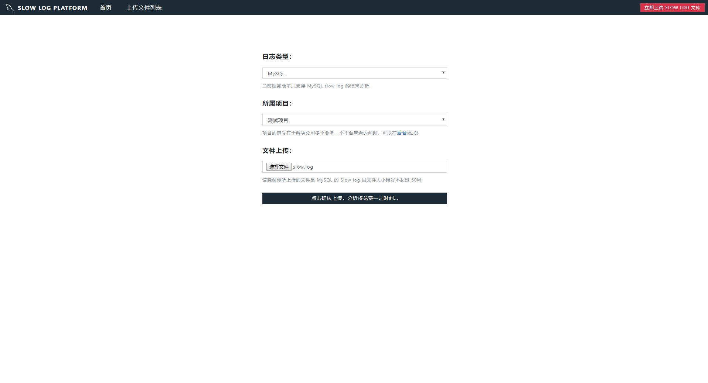
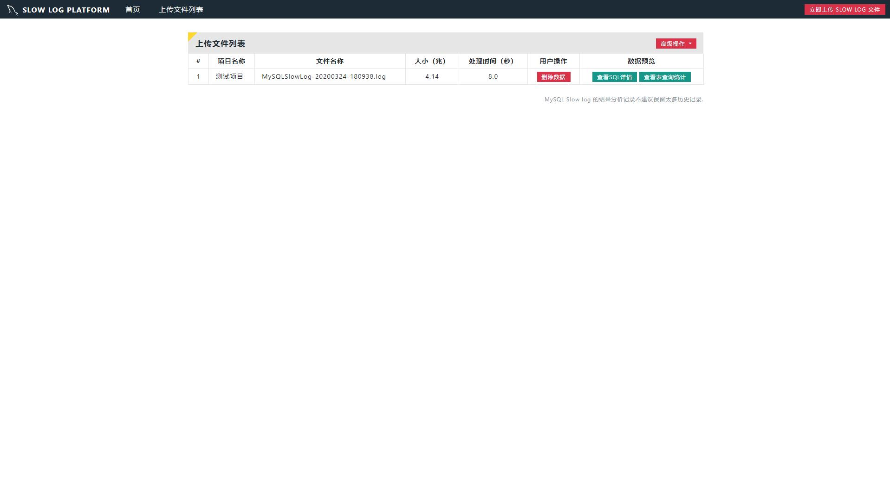
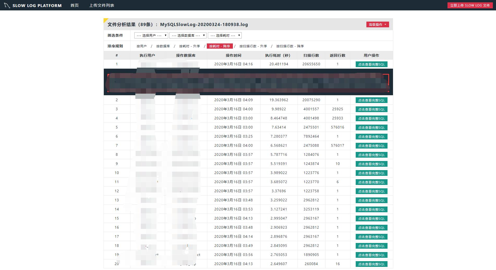
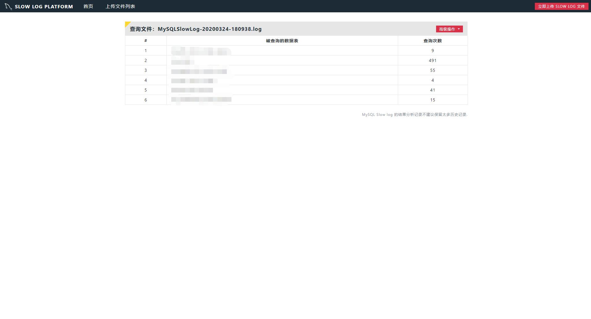

# Slowlog-Tool


### 说明

MySQL 慢日志文本文件处理工具，提供了更为友好的 BS 页面查看。

### 安装方法

#### 1. 安装 docker 
参考我的博客：[博客园：安装 docker](https://www.cnblogs.com/Dy1an/p/12358044.html)

#### 2. 安装 docker-compose
参考我的博客：[博客园：安装 docker-compose](https://www.cnblogs.com/Dy1an/p/12371406.html)

#### 3. 服务器下载代码
```bash
git clone https://github.com/KU4NG/Slowlog-Tool.git
```

#### 4. 启动服务
```bash
cd Slowlog-Tool
docker-compose -f docker-compose.yaml up -d
```

### 服务说明

- 服务由 Python django 容器 和 nginx 容器构成。
- 由于该服务数据重要性并不高，所有使用的默认数据库 SQLite。
- django 运行端口 8000，nginx 运行端口 10000。
- 后台用户默认为：admin / admin
- 运行成功的后第一步是去后台添加项目。

### 效果预览

#### 上传页面


#### 上传列表


#### SQL列表


#### 数据表统计
